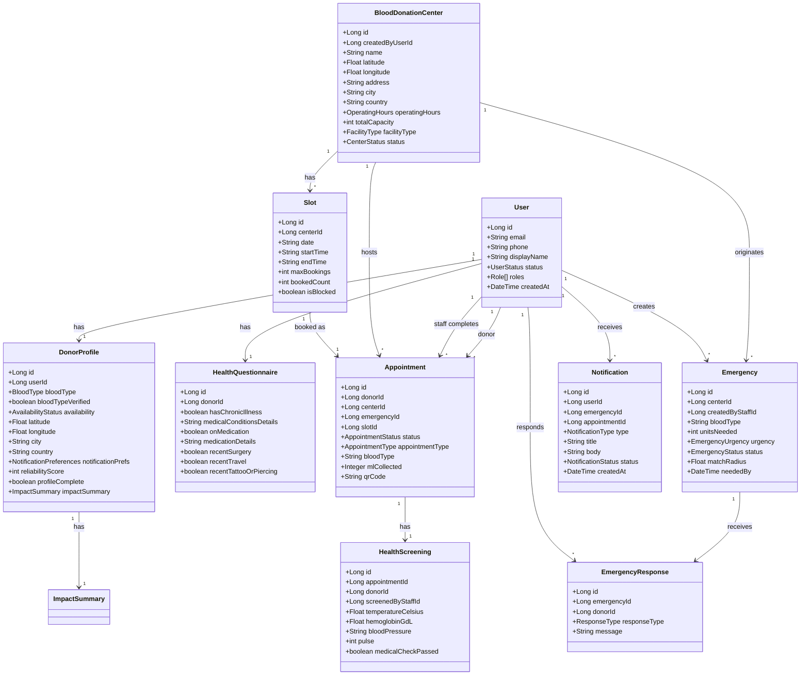
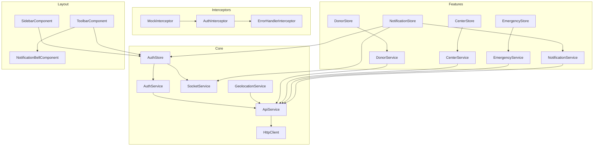

# Qatra — Blood Donation Platform

## Stack

| Layer | Technology |
|-------|-----------|
| Framework | Angular 20 (standalone components, lazy loading) |
| UI Components | PrimeNG 20.5 LTS (Aura preset, dark mode off) |
| CSS | Tailwind CSS v4 + PrimeIcons v7 + Leaflet maps |
| State Mgmt | @ngrx/signals 20.1 |
| Validation | Zod 3.23 |
| Real-time | STOMP (@stomp/stompjs + SockJS) |
| Maps | Leaflet |
| Charts | Chart.js |
| QR | html5-qrcode |
| CSV | PapaParse |
| Mock Backend | In-memory (1176 lines, all entities) |
| Real Backend | Spring Boot (:8080), Notification WS (:8081) |
| Build | Vite via @angular/build 20 |

---

## Use Cases & Features

### Public
- **Landing page** (`/`) — pre-auth home
- **Login** (`/auth/login`, `/auth/staff-login`, `/auth/admin-login`) — role-targeted login (same component, route data)
- **Register** (`/auth/register`) — new donor signup
- **Verify email** (`/auth/verify-email`)
- **Forgot / Reset password** (`/auth/forgot-password`, `/auth/reset-password`)

### Donor (`/donor`)
| Route | Page | Purpose |
|-------|------|---------|
| `/dashboard` | Dashboard | Stats (blood type, eligibility, reliability, lives saved), quick actions, profile status |
| `/profile` | Profile | Edit display name & phone; danger zone (GDPR deletion) |
| `/health-questionnaire` | Health Questionnaire | Chronic illness, medication, surgery, travel, tattoos |
| `/blood-type` | Blood Type | Select/update blood type (locked after verification) |
| `/location` | Location | Manual coords or GPS-based location |
| `/availability` | Availability | Toggle Available / Unavailable / Vacation |
| `/notification-prefs` | Notification Prefs | Frequency, quiet hours, emergency alerts, max distance |
| `/impact` | Impact | Donation count, lives saved, milestone achievements (charts) |
| `/certificates` | Certificates | Download donation certificates |

### Center (`/centers`)
| Route | Page | Purpose |
|-------|------|---------|
| `/list` | Center List | Browse/search/filter centers (map view) |
| `/:id` | Center Detail | Info, hours, map |
| `/:id/manage` | Center Manage | Staff: edit details, manage staff |
| `/:id/book` | Slot Booking | View available slots & book |

### Appointment (`/appointments`)
| Route | Page | Purpose |
|-------|------|---------|
| `/book` | Booking | Select center → date → slot |
| `/my-appointments` | My Appointments | Donor's appointment list |
| `/staff-queue` | Staff Queue | Today's queue (filtered by status) |
| `/checkin` | Check-in | QR code or appointment ID |
| `/:id/screening` | Screening | Staff records vitals, pass/fail |
| `/:id/complete` | Completion | Record volume, blood type, notes |
| `/donation-history` | Donation History | Filtered/paginated history |

### Emergency (`/emergencies`)
| Route | Page | Purpose |
|-------|------|---------|
| `/list` | Emergency List | Active emergencies |
| `/create` | Create Emergency | Staff: blood type, units, urgency, deadline |
| `/:id` | Emergency Detail | Matched donors, response stats, respond |
| `/history` | Emergency History | Past emergencies |

### Admin (`/admin`)
| Route | Page | Purpose |
|-------|------|---------|
| `/dashboard` | Dashboard | System stats (emergencies, donors, response rate, top centers) |
| `/users` | Users | List users, filter by role/status |
| `/users/:id` | User Detail | View/edit user, assign roles |
| `/centers` | Center Approval | Approve/reject pending centers |
| `/config` | Configuration | Edit system config entries |
| `/feature-flags` | Feature Flags | Toggle features on/off |
| `/audit-logs` | Audit Logs | Searchable audit log |
| `/deletion-requests` | Deletion Requests | Process GDPR deletion requests |
| `/reports` | Reports | Platform reports + CSV export |
| `/forecasts` | Forecasts | Blood demand forecasts by blood type/region |

### Notification (`/notifications`)
| Route | Page | Purpose |
|-------|------|---------|
| `/list` | Notification Center | List notifications, mark read |

---

## Entity Relationships

---

## Key Service Architecture

---

## API Endpoints

| Service | Base | Key endpoints |
|---------|------|---------------|
| **Auth** | `/api/v1/auth` | `POST register, login, verify-email, forgot-password, reset-password, refresh, logout` |
| **Donors** | `/api/v1/donors` | `GET/PUT /me`, `PUT /me/blood-type`, `/me/location`, `/me/availability`, `GET/PUT /me/health-questionnaire`, `GET /me/impact`, `/me/certificates`, `/me/eligibility`, `PUT /me/notification-prefs`, `DELETE /me` |
| **Centers** | `/api/v1/centers` | `GET /`, `GET/POST /:id`, `PUT /:id`, `PATCH /:id/status`, `GET /:id/slots`, `PATCH /:id/slots/:sid/block`, `POST /:id/closures`, `GET/POST /:id/staff`, `DELETE /:id/staff/:uid` |
| **Emergencies** | `/api/v1/emergencies` | `GET /`, `POST /`, `GET /:id`, `PATCH /:id/status`, `POST /:id/resolve`, `GET /:id/matches`, `POST /:id/respond`, `GET /history`, `/my-responses` |
| **Appointments** | `/api/v1/appointments` | `GET /`, `POST /`, `GET /:id`, `PATCH /:id/reschedule`, `POST /:id/cancel`, `POST /checkin`, `POST /:id/no-show`, `POST /:id/screening`, `POST /:id/complete`, `GET /my`, `/history`, `/center-queue` |
| **Notifications** | `/api/v1/notifications` | `GET /`, `PATCH /:id/read`, `PATCH /read-all`, `GET /unread-count` |
| **Admin** | `/api/v1/admin` | `GET /dashboard`, `GET/PATCH /users`, `GET/PATCH /users/:id`, `DELETE /users/:id`, `GET /audit-logs`, `GET/PUT /config`, `GET/PUT /feature-flags`, `GET /deletion-requests`, `POST /deletion-requests/:id/process`, `GET /reports`, `/forecasts` |

**Interceptors** (order): `mockInterceptor` → `authInterceptor` (Bearer token + 401 refresh) → `errorHandlerInterceptor`

**WebSocket**: `ws://host/notification-service/ws` → STOMP → proxied to Spring Boot Notification Service (:8081)

**Proxy**: `/api/*` → `localhost:8080`, `/notification-service/ws` → `localhost:8081`

---

## Build Status

**Production build: ✅ passes** (zero errors, only warnings: unused imports, budget +36 KB, CommonJS deps)

**Migration**: 100% of Angular Material components replaced with PrimeNG v20 equivalents across all 9 donor pages + auth/appointment/admin/layout/shared modules.
